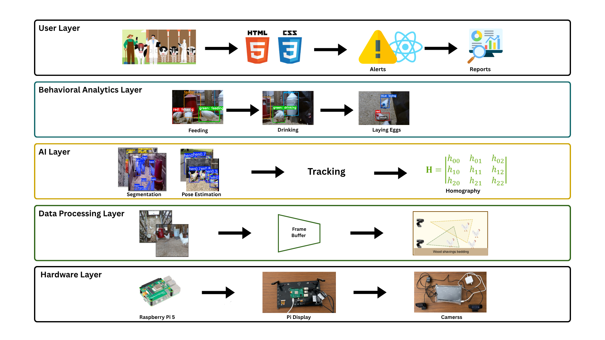
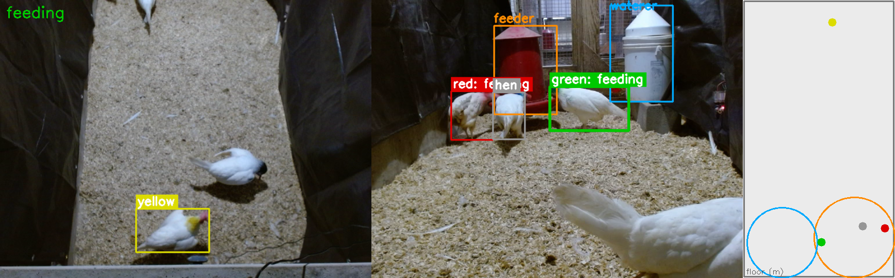
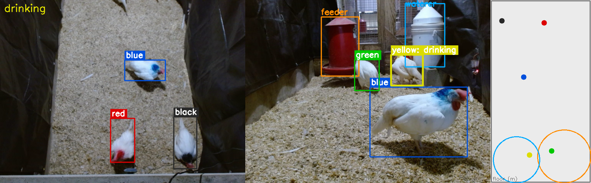
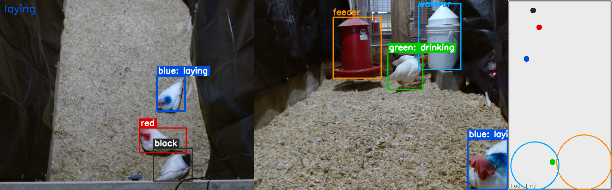
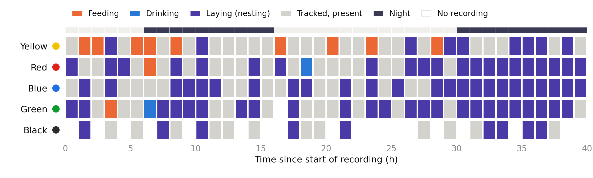
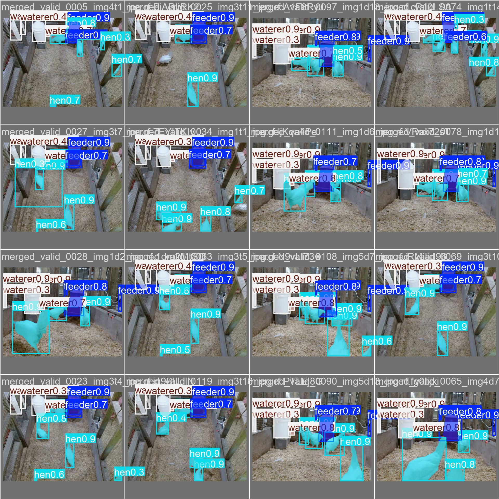
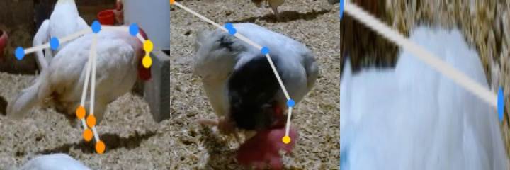

# Poultry Vision

**A lightweight multi-view edge-AI system for continuous behavior monitoring of
laying hens.**

Poultry Vision monitors individual laying hens in cage-free pens from two
synchronized, low-cost camera views and reports their daily feeding, drinking, and
nesting behavior. Birds that look identical are told apart by a **color-as-identity**
scheme, the two views are fused onto a shared **metric floor frame** by planar
homography, and posture is recovered with a compact **pose** model — all designed to
run on an affordable **Raspberry Pi 5 + Hailo-8** edge platform, inside the barn,
without cloud servers.

This repository accompanies our manuscript on multi-view laying-hen monitoring
(Prairie View A&M University, Poultry Center).

<p align="center">
  
</p>

## Highlights
- **Multi-view perception.** An overhead camera maps the whole pen floor while a
  lateral camera captures posture and gait; the two are combined into one metric,
  floor-referenced frame.
- **Color-as-identity.** Five distinctly paint-marked hens are kept apart by a
  mask-based color signature with uniqueness-constrained temporal voting — no
  re-identification network required.
- **Behavior from the fused pen state.** Feeding and drinking from resource-zone
  occupancy; nesting from prolonged stationary dwell; activity from floor motion +
  posture.
- **Edge-first.** Instance segmentation, pose estimation, and tracking on a
  Raspberry Pi 5 with a Hailo-8 accelerator.

## System in action
The system overlays detections, color identities, and inferred behavior on both
views, and places every bird on a shared floor map.

<p align="center">
  <br>
  <br>
  
</p>

Aggregated over the multi-day recording, each hen's behavior is summarized as an
hourly ethogram (identity is maintained throughout; feeding concentrates in the day,
nesting at night):

<p align="center">
  
</p>

## Hardware
- **Compute:** Raspberry Pi 5 (4 GB) + Hailo-8 AI HAT+ accelerator.
- **Cameras:** two Logitech C920 USB webcams (overhead + lateral) and a Reolink
  global-top camera that covers the entire pen floor.
- **Pen:** 1.50 m × 2.74 m × 0.91 m, wood-shaving litter, four nest boxes, one feeder,
  one waterer; five color-marked hens per pen.

Cameras are served on the Pi as RTSP streams (via MediaMTX) and consumed by role;
see [`config/cameras.yaml`](config/cameras.yaml).

## Models & results
Perception uses the single-stage **YOLOv12** family (a vendored fork in
[`ultralytics/`](ultralytics/)). Held-out test performance:

| Task | View | Model | Metric | Score |
|------|------|-------|--------|------:|
| Detection + instance segmentation | Top-down | YOLOv12s-seg | box / mask mAP@0.5 | **0.980 / 0.981** |
| Pose (10 keypoints) | Lateral (crops) | YOLOv12s-pose | keypoint mAP@0.5 | **0.643** |
| Cross-view calibration | Both | Homography (borrow-solve) | mean floor agreement | **0.028 m** |

<p align="center">
  
  
</p>

## Dataset
- **Detection / segmentation:** 947 annotated images, three classes
  (feeder, hen, waterer), 8,591 instances.
- **Pose:** 205 annotated images (682 hen instances) on a 10-keypoint anatomical
  schema (beak, comb, neck/back, tail, and left/right hock & foot), extended with
  per-hen crops that match the crop-based inference path.

## Repository layout
| Path | Contents |
|------|----------|
| `src/` | Runtime pipeline — calibrated floor projection & gating (`floor.py`), color identity (`identity.py`, `color_marker.py`), capture (`capture.py`), camera roles & sync (`multiview.py`), behavior (`behavior.py`), geometry & overlays, detect/pose/track helpers |
| `scripts/track_pen.py` | Multi-camera detection + tracking + color identity + floor map |
| `scripts/calibration/` | ChArUco / stereo intrinsic & extrinsic calibration toolkit |
| `calibrate_corners.py` | Interactive floor calibration (overlap tie-point *borrow-solve*, and direct four-corner clicking from the global-top camera) |
| `config/` | Camera roles (`cameras.yaml`), system / label / resource configs, model definitions |
| `models/hailo/` | Compiled Hailo detection models (`.hef`) + labels |
| `pen_config.json` | Pen geometry, camera placement, homographies, coordinate convention |
| `assets/` | Figures and inference / training samples used here and in the paper |

## Installation
```bash
python -m venv .venv
source .venv/bin/activate            # Windows: .venv\Scripts\activate
pip install -r requirements.txt
pip install -e .                     # the vendored YOLOv12 fork
```

## Usage
```bash
# One-time floor calibration (click pen-floor corners), then reuse
python calibrate_corners.py --config pen_config.json

# Multi-camera detection + tracking + color identity + floor map
python scripts/track_pen.py --pair 20260605_141702 --csv out.csv        # recorded
python scripts/track_pen.py --live --location pi --top sub               # live (on the Pi)
```

## Citation
If you use this work, please cite our paper (details to be updated on publication):

```bibtex
@article{poultryvision2026,
  title   = {A Lightweight Multi-View Edge-AI Framework for Laying-Hen Behavior Monitoring},
  author  = {Ogbuigwe, Daniel and Rhaman, Fyaz and Owono Afugu Ntoo, Joaquin and
             Ahmed, Ahmed Abdelmoamen and Abdel-Wareth, Ahmed A. A. and Lohakare, Jayant},
  year    = {2026},
  note    = {Prairie View A\&M University}
}
```

## Acknowledgments
Prairie View A&M University — Department of Computer Science and the Poultry Center,
College of Agriculture, Food and Natural Resources. Supported in part by the U.S.
National Science Foundation (grants #2200377 and #2302469).
